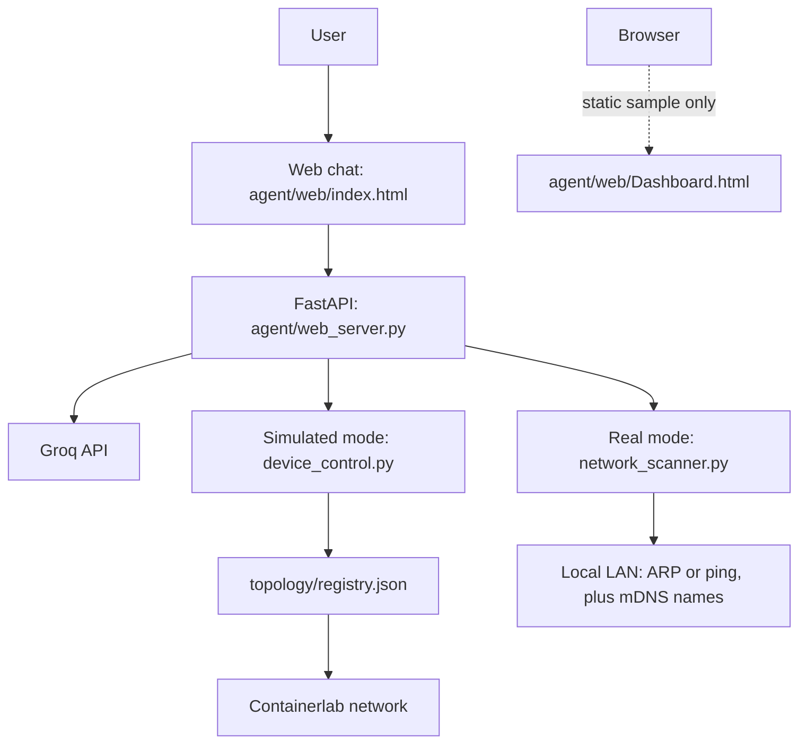

# FYP-Netmind (NetMind)

NetMind is an LLM-powered network operations assistant. In simulated mode, it
can query and control a Containerlab network (routers, firewalls, hosts, and
cameras) using natural language. In real-network mode, it can discover devices
on the local LAN and check whether they are online; it cannot control them.

## Architecture



## Stack

- **Network emulation:** [Containerlab](https://containerlab.dev/) on native
  `docker-ce` inside a WSL2 Ubuntu distro (not Docker Desktop's own engine;
  see [Setup](#setup)).
- **Firewalls:** custom `netmind-firewall` image (Alpine + `iptables`) with
  live firewall rules.
- **Cameras:** custom `netmind-camera` image (Alpine + Python) with a fake HTTP
  service simulating camera stream and snapshot endpoints.
- **LLM:** Groq API (`openai/gpt-oss-120b`) with tool calling.
- **Backend:** FastAPI + Docker SDK.
- **Frontend:** vanilla JavaScript chat UI with English/Arabic and light/dark
  themes.

## Repository layout

```text
.
├── agent/
│   ├── agent_core.py           # Tool-calling loop, sessions, confirmation guard, audit log
│   ├── device_control.py       # Control and inspect simulated lab devices
│   ├── netmind_agent.py        # Terminal REPL agent
│   ├── network_scanner.py     # Discover and check devices on the real LAN
│   ├── web_server.py           # FastAPI backend and chat-mode dispatch
│   └── web/
│       └── index.html          # Chat UI + live dashboard and logs
├── collectors/                 # Reserved for future diagnostics
├── docker/
│   ├── camera/                 # Camera image and service scripts
│   └── firewall/               # Firewall image and entrypoint
├── docs/                       # Project report
├── tests/                      # Unit tests (+ integration/ for the live lab)
├── topology/
│   ├── branches.py             # Shared network layout configuration
│   ├── generate_topology.py    # Generates netmind-large.clab.yml
│   ├── build_registry.py       # Builds machine-specific registry.json
│   ├── netmind-lab.clab.yml    # Small starter topology
│   └── netmind-large.clab.yml  # Generated larger topology
├── Makefile                    # make up / down / test / lint / run
├── CONTRIBUTING.md
└── requirements.txt
```

## Safety

Destructive actions (`power_off`, `block_port`, `allow_port`,
`change_camera_credentials`) are never executed straight from the model. They
create a *pending action* that the user must confirm with the Confirm button in
the chat (or the dashboard prompt for power-off). Protected devices (`r1` and
all firewalls) need an extra acknowledgement. Every tool call is written to an
audit log (`GET /api/audit`, and `logs/audit.jsonl`). Firewall rules are applied
to both the INPUT and FORWARD chains, so a blocked port is also blocked for
traffic passing through the firewall to other branches.

## Development

```bash
pip install -r requirements.txt -r requirements-dev.txt
make lint && make test
```

See [CONTRIBUTING.md](CONTRIBUTING.md) for the PR and review workflow.

## Features

- **Simulated mode:** check device status/IP, list devices, and power devices
  on or off.
- **Firewall auditing** (`fw-branch1/2/3`): inspect live `iptables` rules and
  open ports, audit common misconfigurations, and block or allow ports.
  Rule changes survive normal NetMind power cycles but reset after a
  `containerlab destroy` and redeploy.
- **Camera realism** (`cam-khalid`, `cam-ahmed`, `cam-fahad`): fake HTTP
  `/stream` and `/snapshot` endpoints; check stream reachability separately
  from container status; start or stop the stream; check or change the camera
  password. These are simulated cameras, not real RTSP devices.
- **Real-network mode:** scan the local network and check device status or
  resolve hostnames/IP addresses. It is discovery/status-only and cannot power
  off or otherwise control real devices.

## Setup

1. Install a **native `docker-ce`** engine inside your WSL2 Ubuntu distro.
   Docker Desktop's engine does not reliably expose the network-namespace and
   bridge access Containerlab needs.
2. Install [Containerlab](https://containerlab.dev/) inside that same distro.
3. Create a Python virtual environment and install dependencies:

   ```bash
   python3 -m venv .venv
   source .venv/bin/activate
   pip install -r requirements.txt
   ```

4. Add a `.env` file at the repository root (it is gitignored):

   ```dotenv
   GROQ_API_KEY=your_key_here
   ```

5. Build the custom firewall and camera images before the first deploy, and
   again whenever their Dockerfiles or scripts change:

   ```bash
   docker build -t netmind-firewall:latest docker/firewall/
   docker build -t netmind-camera:latest docker/camera/
   ```

### Deploy the simulated lab (one command)

From the repository root:

```bash
make up     # build images, create bridges (idempotent), deploy lab, build registry.json
make down   # destroy the lab
```

`make up` is safe to re-run, including after a host reboot: it recreates the
Linux bridges and host FORWARD rules only if they are missing, then deploys
with `containerlab deploy --reconfigure` and runs `build_registry.py`.
Individual steps are available as `make lab-build`, `make lab-bridges` and
`make lab-up`. `topology/registry.json` is machine-specific and gitignored.

## Run NetMind

With the virtual environment activated, the lab deployed, and `.env` set, from
the repository root:

```bash
make run    # same as: cd agent && uvicorn web_server:app --reload
```

Open <http://127.0.0.1:8000/> for the connected chat UI. Choose **Simulated**
to query/control the Containerlab lab or **Real Network** to scan the LAN and
check online status. Real mode is read-only: it does not offer power control.
The scanner guesses the local `/24` subnet from the machine's default-route IP.
It uses ARP when Scapy and the required raw-socket permissions are available;
otherwise it falls back to ping. mDNS can add hostnames, but not all devices
advertise one.

To run a one-off real-network scan from the `agent/` directory:

```bash
python3 network_scanner.py
```

The terminal agent is an additional, simulated-mode REPL:

```bash
cd agent
python3 netmind_agent.py
```

## Running the server safely

- The server only accepts requests from its own origin (the dashboard it serves) and `make run` binds to `127.0.0.1`, so other websites and other machines cannot reach it. Keep it that way; there is no login yet (planned for Project 2).
- Powering a device back on re-attaches it to its switch with `containerlab tools veth`, which needs root. Instead of running the whole server with `sudo`, you can allow just that command. Run `sudo visudo -f /etc/sudoers.d/netmind` and add one line (replace `youruser`, and check the path with `which containerlab`):

  ```
  youruser ALL=(root) NOPASSWD: /usr/bin/containerlab tools veth *
  ```

  After that `make run` works as a normal user.
- Alert history is saved to `logs/alerts.json` and the audit log to `logs/audit.jsonl` (both git-ignored). Delete them to start from a clean slate.

## Dashboard mock-up

`agent/web/Dashboard.html` is served as a static page at
<http://127.0.0.1:8000/Dashboard.html>, but is **only a visual mock-up**.
Its status, device counts, charts, alerts, and other values are sample content:
the page is not connected to the API, the lab, or the real network, and does
not show live data. Use the chat UI's mode selector for actual NetMind
functionality. The dashboard must remain clearly labelled as a mock-up until
it is connected to live data.

## Notes

- `topology/registry.json` is gitignored because it contains machine-specific
  container IPs. Each teammate generates it locally with `build_registry.py`.
- Never commit secrets. Keep the Groq API key in the local `.env` file.
