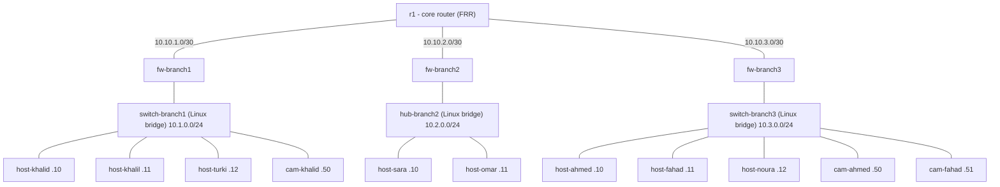
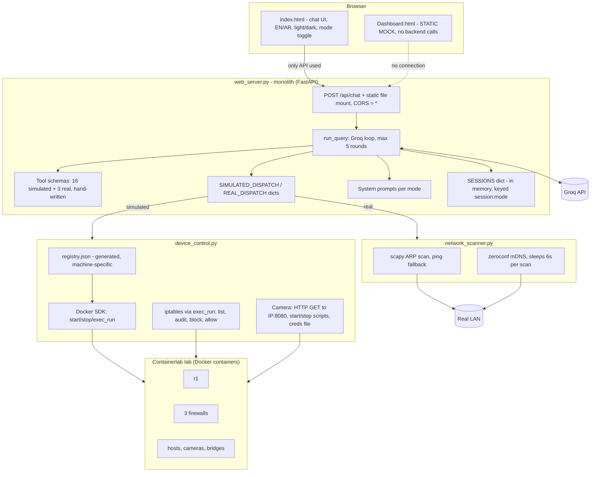
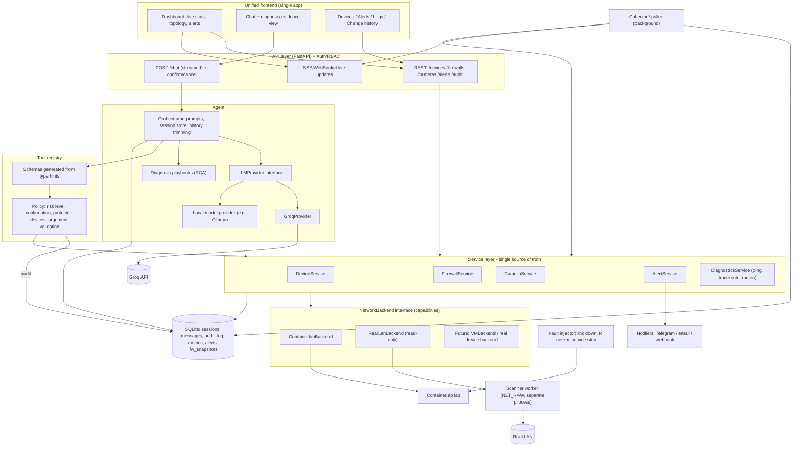
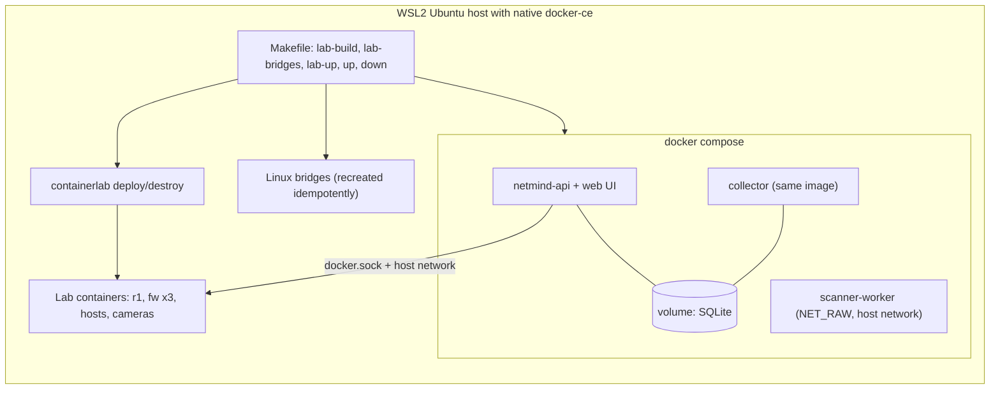
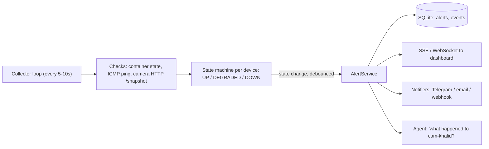
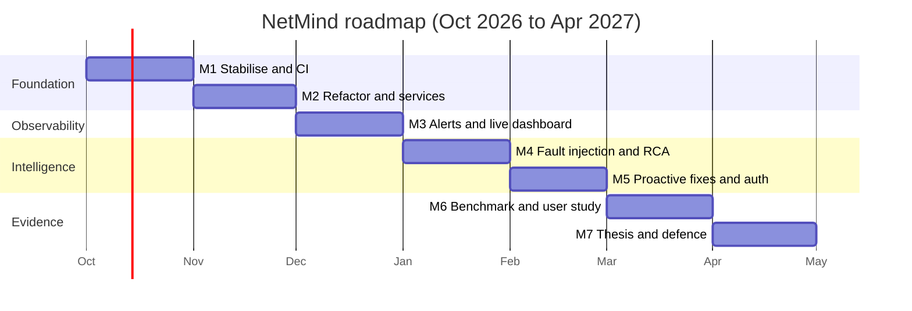

# NetMind (FYP-Netmind): System Assessment and 7-Month Enhancement Plan

**Baseline commit:** `1ce14ac` (18 Sep 2026)
**Prepared for:** the supervisor, Oct 2026
**Team:** Khaled Alghmlas, Faleh Alsubaie, Ibrahim Alharthi

**Scope of review:** `README.md`, `agent/web_server.py`, `agent/device_control.py`, `agent/network_scanner.py`, `topology/branches.py`, `agent/web/Dashboard.html`, `requirements.txt`, the file tree and the 30 most recent commits. Not read: `netmind_agent.py`, `build_registry.py`, `generate_topology.py`, `agent/web/index.html`, the Docker entrypoints, `camera_server.py`. Statements about those files are inferred from the README and commit messages. The commit history is longer than 30 entries, so earlier work is not covered.

---

## 1. Executive summary

NetMind is an LLM-powered network operations assistant. Users manage a simulated network (routers, firewalls, switches and hubs, hosts, IoT cameras) in natural language. In about three weeks the team built a working core:

- a Groq tool-calling agent with 16 simulated-lab tools and 3 real-LAN tools;
- a Containerlab topology of 3 branches around one core router;
- firewall auditing on real `iptables`;
- a fake HTTP camera service;
- a real-LAN discovery mode;
- a bilingual (EN/AR) chat UI.

Main weaknesses:

1. Dangerous actions run without confirmation.
2. The dashboard is static mock data.
3. There is no authentication.
4. The code is a monolith with duplicated tool definitions.
5. There are no tests, no CI and no evaluation of the agent.

The plan uses 7 months to fix these in order: **stabilise, refactor, observe, diagnose, act safely, evaluate, deliver.**

---

## 2. The current system

### 2.1 Technology stack

| Layer | Technology |
|---|---|
| Network emulation | Containerlab on native `docker-ce` in WSL2 Ubuntu |
| Devices | `frrouting/frr` (core router `r1`), custom `netmind-firewall` (Alpine + iptables), custom `netmind-camera` (Alpine + Python), Alpine hosts, Linux bridges for switches and hubs |
| LLM | Groq API, model `openai/gpt-oss-120b`, tool calling |
| Backend | FastAPI, Docker SDK, `requests`, scapy, zeroconf |
| Frontend | Vanilla JS chat UI (`index.html`), Bootstrap dashboard mock (`Dashboard.html`) |
| Config and state | `topology/branches.py`, generated `registry.json` (gitignored), in-memory `SESSIONS` dict |

### 2.2 Simulated topology

`branches.py` is the single source of truth for the layout and IP plan.

### 2.3 Current architecture (as-is)

Request path: the browser sends `POST /api/chat` with `session_id`, `message` and `mode`. The server picks a tool set, prompt and dispatch table for that mode and calls Groq. Each tool call runs against Docker/iptables or the real LAN, and the result is fed back to the model until it produces text or hits the 5-round cap.

### 2.4 Feature inventory

| Feature | Status | Notes |
|---|---|---|
| Device status, IP, power on/off, list | Working | Case-insensitive; owner-based matching; idempotency reporting (`already_in_that_state`). |
| Segment listing | Working | `list_devices_on_segment`. |
| Firewall: rules, open ports, audit | Working | Parses `iptables -L INPUT`; first-match-wins logic; flags open SSH/Telnet/FTP/RDP. |
| Firewall: block/allow, persistence | Working | Rules saved with `iptables-save`, restored on restart. |
| Camera: stream status, start/stop, credentials | Working | Real HTTP check; stream service independent of container power. |
| Real-LAN discovery | Basic | ARP or ping scan, mDNS names, online/offline check, no control. |
| UI | Chat: working. Dashboard: mock. | EN/AR, light/dark, markdown. |
| Guardrails | Prompt-only | Off-topic refusal, language matching. |
| Resilience | Partial | Groq call and tool dispatch wrapped in try/except. |

### 2.5 Strengths

- Realistic design choices: a real `iptables` firewall and a camera whose stream is checked over HTTP make the lab a credible testbed.
- `branches.py` is a genuine single source of truth for the topology generator and the registry.
- Good commit habits: descriptive messages, root-cause bug fixes (e.g. the `inet_ntoa` bug that silently broke mDNS), generated files kept out of git.
- Real vs. simulated mode is a sensible scoping decision.
- The agent already reports idempotency and errors in user-friendly language.

---

## 3. Drawbacks

### 3.1 Critical

| # | Finding | Evidence | Impact |
|---|---|---|---|
| C1 | Dashboard is static mock data | `Dashboard.html` hardcodes "48 devices", "98% health", "1.8 GB/s", fake alerts, `192.168.1.x` addresses; no API exists for it | Misleading if presented as real-time; does not match the real lab |
| C2 | No confirmation for destructive actions | `power_off`, `block_port`, `allow_port`, `change_camera_credentials` run directly on the LLM's decision; owner matching can hit several devices | One misread prompt can shut down a branch or lock out a firewall |
| C3 | Firewall audit/blocking may not cover the intended traffic | All logic uses `iptables -L INPUT` / `-I INPUT`; traffic through a firewall to hosts uses FORWARD | "Block port 22" might not block SSH to hosts behind the firewall. **Unverified**: the firewall entrypoint was not read. Must be tested |
| C4 | No authentication; open CORS | `allow_origins=["*"]`, no login | Anyone who can reach the port controls the lab (via the Docker socket) and spends the API quota |
| C5 | Secrets pass through the LLM | `change_camera_credentials(new_password)` puts passwords into the prompt, history and vendor API; credentials stored in plain text in the container | Data leakage; acceptable only in a simulation and should be stated |

### 3.2 Important

| # | Finding | Evidence |
|---|---|---|
| I1 | Real-mode scanner defects | `inet_ntoa` fails on IPv6 and the error is swallowed by `except Exception: pass`; `get_service_info` called inside the zeroconf callback (blocking); `time.sleep(6)` on every scan; hardcoded /24 guess via `8.8.8.8`; ARP needs root and silently falls back to ping |
| I2 | Agent robustness | `json.loads(call.function.arguments)` outside the `try`; `SESSIONS` unbounded and stores SDK objects; generic error at the 5-round cap; no streaming or timeouts |
| I3 | Monolith and duplication | 19 hand-written schemas, two dispatch dicts, prompts, HTTP, state and LLM logic in one 427-line file |
| I4 | Side effects at import | `docker.from_env()` and `os.environ["GROQ_API_KEY"]` run on import, so tests and CI without Docker or a key are impossible |
| I5 | Fragmented state | `registry.json` (per machine), live Docker state, in-memory sessions; no history, audit log, metrics or alerts |
| I6 | Code hygiene | `list_devices()` defined after the `if __name__ == "__main__"` block; unknown names return empty lists silently; `netmind_agent.py` duplicates the loop and is unused; unused dependencies (`netmiko`, `pysnmp`, `paramiko`, `ntc_templates`); `requirements.txt` is a full `pip freeze` |
| I7 | Reproducibility | Bridges created manually and lost on reboot; multi-step image build and deploy |
| I8 | No monitoring or alerting | Nothing runs on a schedule, so a disconnected device or a dead camera stream is only noticed if someone asks |

### 3.3 Process and project management

- No tests, no CI, no LICENSE, no issues or PRs; work is pushed directly to one branch.
- The README is stale: no mention of `network_scanner.py`, real mode or `Dashboard.html`; code blocks have lost their fences.
- **Contribution balance:** of the 30 commits reviewed, Khaled authored about 25, Faleh 3 and Ibrahim 1. This is a partial window, so the full history should be checked. Each student needs individually assessable work.
- No quantitative evaluation of the agent (tool-selection accuracy, latency, safety).

---

## 4. Target architecture (to-be)

### 4.1 Design principles

1. **One service layer.** The REST API and the LLM tools call the same code.
2. **Backends behind an interface.** Simulated and real networks implement `NetworkBackend`; capabilities are enforced in code, not prompts.
3. **Policy in the tool registry.** Risk levels, confirmation, protected devices and audit apply to every tool call.
4. **Persistent state.** SQLite for sessions, audit, metrics, alerts and snapshots.
5. **Observability.** A background collector feeds the dashboard, alerts and proactive behaviour.
6. **Privilege separation and auth.** Scanner as a separate privileged worker; RBAC on the API.

### 4.2 Target architecture diagram

### 4.3 Before and after

| Concern | Current | Target |
|---|---|---|
| Entry points to network logic | Only via the LLM | REST API and LLM share services |
| Tool definitions | 19 hand-written schemas, 2 dispatch dicts | Generated from type hints, one registry |
| Safety | Prompt-only | Confirmation, protected devices, argument validation, audit log |
| Mode handling | Duplicated tool sets per mode | Backend interface with capabilities |
| State | In-memory dict and generated JSON | SQLite (sessions, audit, metrics, alerts, snapshots) |
| Dashboard | Static mock | Live data via REST and SSE |
| Alerting | None | Collector, state machine, debounced alerts, notifications |
| Testing | None | Unit tests with a fake backend; integration tests with the lab; CI |
| Privileges | One process with Docker socket and raw sockets | Scanner worker isolated; auth and RBAC |
| Diagnostics | Status and IP only | Ping, traceroute, routes, RCA playbooks |
| LLM | Hard-wired Groq | Provider interface, model comparison |
| Setup | Multi-step README | `make up` / `docker compose` for the app |

### 4.4 Deployment view

Containerlab stays outside Docker Compose. It is an orchestrator that needs host-level access to namespaces and bridges, and compose cannot express its point-to-point links.

To validate early: the app must reach lab IPs such as `10.N.0.50:8080`, most simply with `network_mode: host`. How the lab's management network is configured has not been verified. Mounting the Docker socket into an unauthenticated service is root-equivalent, so authentication must come first.

---

## 5. Real-time alerts for disconnected devices

### 5.1 Motivation

- `get_status` only reads the Docker container state.
- `get_camera_stream_status` makes a real HTTP request to `http://<ip>:8080/snapshot`.
- Nothing runs on a schedule, so nothing can alert on its own. This is the main gap for security cameras.

### 5.2 Design

- **Three levels of "disconnected":** container stopped, network unreachable (ping fails), service dead (container up but `/snapshot` fails). The third is the "on but not streaming" state the lab already simulates.
- **Debounce:** 2 to 3 consecutive failures before alerting; a recovery alert when the device returns.
- **Severity:** cameras and firewalls `critical`, hosts `warning`, defined in `branches.py` with device roles.
- **Deduplication and acknowledgement:** one open alert per device; an "acknowledge" action in the UI.
- **Notifications outside the browser:** Telegram bot, email or webhook.
- **Agent integration:** the LLM summarises open alerts and can propose a fix (for example restart the camera stream) through the confirmation flow.

### 5.3 Evaluation

Use the fault injector (Month 4) to stop a container, stop the camera service and add `tc netem` loss. Report detection latency, missed detections and false alarms. This gives quantitative thesis evidence.

### 5.4 Other services proposed

| # | Service | What it adds | Effort | Value |
|---|---|---|---|---|
| 1 | Security posture scoring | Per-device and per-branch score from firewall and camera audits, with trends | Low | High |
| 2 | Configuration backup, diff, rollback | `iptables-save` snapshots before each change, diff view, restore | Medium | High |
| 3 | Audit trail page | Who asked for what, what the agent did, results | Low | High |
| 4 | Scheduled reports | Daily or weekly LLM summary of uptime, alerts and findings | Low | Medium |
| 5 | Uptime and SLA tracking | Availability and MTTR from alert history | Low | Medium |
| 6 | New-device and anomaly detection | Unknown MACs and unusual behaviour on the real LAN | Medium | High |
| 7 | Traffic and bandwidth monitoring | Interface counters, top talkers, link utilisation | Medium | High |
| 8 | Remediation playbooks | Alert leads to a suggested or applied fix, always via confirmation | Medium | High |
| 9 | Root-cause analysis | Structured diagnosis with evidence (planned, Month 4) | Medium | High |
| 10 | Live topology map | Graph coloured by status, built from `branches.py` and the registry | Medium | High |
| 11 | Arabic-first / voice assistant | Speech input and Arabic answers | Medium | Medium |
| 12 | Multi-user and RBAC | Viewer, operator, admin roles | Medium | Medium |
| 13 | Log collection | Container logs and firewall drops in a searchable view | Medium | Medium |
| 14 | Camera extras | Snapshot thumbnails, tamper or motion simulation, stream health history | Low | Medium |

**Priority:** real-time alerts, traffic monitoring and the live topology map (Month 3); security score and uptime/SLA (Months 3 to 4); new-device detection (Month 5). Pick at most two or three of the rest, and treat the others as stretch items to drop first, so diagnosis (M4) and evaluation (M6) are not put at risk.

---

## 6. Seven-month enhancement plan (Oct 2026 to Apr 2027)

### 6.1 Tracks and ownership

| Track | Scope | Suggested owner |
|---|---|---|
| A: Core/backend | Services, backends, storage, collector, auth, Docker/Makefile | Khaled (holds most of the current code) |
| B: AI/agent | Tool registry, orchestrator, RCA, evaluation harness | The student who wants the LLM angle |
| C: Frontend and real network | Unified UI, live dashboard, scanner worker, real-LAN mode | Faleh (real mode, web UI) and Ibrahim (dashboard) |

Assumption: 8 to 10 focused hours per student per week. Adjust dates to the academic calendar. Each student reviews a teammate's PR weekly so everyone can explain every layer at the defence.

### 6.2 Roadmap

### 6.3 Month-by-month detail

**Month 1 (Oct): stabilise and set up the process**

- *All:* protect `main`, require PRs with review, `CONTRIBUTING.md`, a GitHub Project board with one issue per task, `ruff` and `pytest` in GitHub Actions.
- *A:* verify the firewall FORWARD-chain behaviour with `nc`/`curl` between branches and fix it; fix the `json.loads` crash, session trimming, the `inet_ntoa`/IPv6 bug and the blocking mDNS call; Makefile with `lab-up`, `lab-down` and idempotent bridge creation.
- *B:* confirmation flow for `power_off`, `block_port`, `allow_port` and `change_camera_credentials`; protected-device list (`r1`, firewalls); file-based audit log.
- *C:* rewrite the README (fenced code blocks, current features, architecture diagram); label `Dashboard.html` as a mock-up until connected.
- **Milestone M1:** a clean clone runs with `make up`, CI is green, dangerous actions need confirmation.

**Month 2 (Nov): architecture refactor**

- *A:* extract `DeviceService`, `FirewallService`, `CameraService` with Pydantic models; add the `NetworkBackend` interface with `ContainerlabBackend` and `RealLanBackend`; `Settings` class and app factory with no import-time side effects.
- *B:* tool registry with schemas generated from type hints, risk levels and policy enforced in code; delete duplicated dicts; `LLMProvider` interface with `GroqProvider`.
- *C:* merge `index.html` and `Dashboard.html` into one app shell (shared navigation, theme, EN/AR).
- *All:* SQLite for sessions and the audit log; unit tests with a fake backend, target at least 60% coverage on services.
- **Milestone M2:** API and agent call the same services, tests run in CI without Docker or a Groq key, history survives a restart.

**Month 3 (Dec): observability and real-time alerts**

- *A:* collector in `collectors/` (status, CPU and memory via `docker stats`, ping reachability, camera `/snapshot` check, firewall state); per-device state machine (UP/DEGRADED/DOWN) with debounce, severity, deduplication and acknowledgement; SQLite storage; REST endpoints and SSE.
- *C:* connect the dashboard to live data (device counts, topology from the registry or `containerlab inspect`, alerts, metrics chart, traffic); remove all hardcoded numbers; add Telegram or webhook notifications.
- *B:* diagnostic tools `ping_between`, `traceroute`, `get_routes` (via `vtysh` on `r1`), `get_interface_stats`, `get_alerts`; the agent answers history questions.
- *Note:* this month overlaps exams, so schedule lighter tasks (tests, documentation, bug fixes) and cut optional items first.
- **Milestone M3:** the dashboard shows live lab state; stopping a container or a camera stream raises an alert within a defined time and sends a notification; the agent can query history.

**Month 4 (Jan): intelligence I, diagnosis and fault injection**

- *A:* fault-injection module with scripted, reversible scenarios: link down, `tc netem` latency and loss, service stopped, firewall misconfiguration, camera credential reset.
- *B:* root-cause analysis. For "host-ahmed can't reach cam-fahad", run a structured playbook (status of both ends, ping, traceroute, firewall rules, routes) and produce a diagnosis with evidence. Keep the steps in code; the LLM interprets results.
- *C:* a diagnosis view showing the evidence chain step by step.
- *A/B:* measure alert detection latency and false alarms using the injector.
- **Milestone M4:** at least 10 fault types, with the agent diagnosing most correctly without hints.

**Month 5 (Feb): intelligence II, proactive and safe change**

- *B:* proactive suggestions (open SSH or default camera password leads to a proposed fix through the confirmation flow); periodic security report; remediation playbooks triggered from alerts.
- *A:* configuration snapshots, diffs, dry run and rollback for firewall rules; change history; authentication and RBAC (viewer, operator, admin); split the scanner into a privileged worker.
- *C:* real-LAN extensions: MAC vendor lookup, device inventory over time, "new device joined" alert. Document the authorisation boundary for scanning.
- **Milestone M5 (feature freeze):** every feature runs through the confirmation and audit path; rollback works.

**Month 6 (Mar): evaluation and hardening**

- *B:* benchmark of 100+ English and Arabic prompts with expected tool calls and arguments. Measure tool-selection accuracy, argument accuracy, task success, latency and token cost. Include adversarial cases: prompt injection through device names, off-topic bypass, ambiguous references ("turn off khalid"), destructive requests without confirmation.
- *A/B:* model comparison through the provider interface (Groq `gpt-oss-120b` against a smaller and a local model): accuracy, latency, privacy.
- *A:* failure and load tests (concurrent sessions, Docker daemon down, Groq timeouts, larger topologies).
- *C:* small usability study (5 to 10 participants, 5 scripted tasks, NetMind vs. plain CLI): time to completion, errors, SUS questionnaire.
- **Milestone M6:** benchmark results, security test report, user-study data.

**Month 7 (Apr): documentation, polish and defence**

- Thesis chapters: architecture, threat model, evaluation, limitations (simulation vs. real, LLM non-determinism, scanning scope) and the perspectives section below.
- Tagged v1.0 release, demo script, recorded backup video, clean quick start.
- At least two weeks of buffer for slippage.
- Two mock defences with the supervisor.

### 6.4 Milestone summary

| Month | Theme | Deliverable |
|---|---|---|
| Oct | Stabilise | CI, PR workflow, confirmation flow, `make up` |
| Nov | Refactor | Services, backends, tool registry, SQLite |
| Dec | Observe | Collector, real-time alerts, live dashboard, diagnostic tools |
| Jan | Diagnose | Fault injection, RCA agent, evidence view |
| Feb | Act safely | Proactive fixes, rollback, auth, scanner worker |
| Mar | Evaluate | Benchmark, model comparison, user study |
| Apr | Deliver | Thesis, v1.0, demo, defence |

### 6.5 Risks and mitigations

| Risk | Mitigation |
|---|---|
| Exam periods slow progress (Dec, likely Apr) | Lighter tasks in those months and a two-week buffer at the end |
| Knowledge concentrated in one student | Weekly cross-review, per-track deliverables, rotating demo duties |
| WSL2 or Containerlab instability | Makefile automation and a documented fallback VM |
| LLM API cost or rate limits | Response caching and a local-model provider |
| Scope creep | Stretch items need supervisor approval and are dropped first |
| Real-network scanning legality and ethics | Scan only authorised networks; state the boundary in the thesis and the UI |

### 6.6 Success criteria

1. A live dashboard backed by real collected data.
2. Disconnected devices, especially cameras, raise alerts in real time, with measured detection latency.
3. Destructive actions are impossible without confirmation and are always audited.
4. Injected faults are diagnosed by the agent, with measured accuracy.
5. One-command reproducible setup.
6. A thesis with quantitative evaluation, not only a demo.
7. Every student has assessable individual contributions.

### 6.7 Supervision checkpoints

- Fortnightly demo and review against the milestones. Treat M1 and M2 as gates.
- A short "explain the code" session per student each month.
- Questions for the students:
  1. Why does `block_port` affect traffic to hosts? Show a packet-level test.
  2. What stops the agent from powering off the core router?
  3. Which parts of the dashboard are live?
  4. How do you know the LLM picks the right tool, and what is the measured accuracy?
  5. How quickly is a stopped camera detected, and how many false alerts occur?
  6. Can each member run the full stack from a fresh clone?

---

## 7. Perspectives and future work

### 7.1 Virtual machine management (out of the 7-month scope)

**Motivation.** The lab devices are containers that share the host kernel. Production networks are largely VMs and servers. VM management would make hosts behave like real machines (own kernel, real services, OS-level faults) and give resource controls (RAM, vCPUs) a meaningful home. Those controls were prototyped and then reverted (commits `c399c8f` and `52ec5133`) because containers do not allocate fixed RAM or cores the same way.

**Proposed design.**
- A `VMBackend` behind the existing `NetworkBackend` interface, declaring capabilities such as `power`, `snapshot`, `resources`, `console`.
- VMs returned through the same `Device` model (type `vm`), so the dashboard, collector and agent see one inventory.
- VMs attached to the same Linux bridges as the lab; `branches.py` extended to remain the single source of topology truth.
- VM tools registered with risk levels: snapshot restore, delete and resource changes are `destructive` and need confirmation and audit.
- VM CPU and memory fed into the collector and dashboard; VM scenarios added to fault injection.

**Hypervisor options.**

| Option | Suitability |
|---|---|
| libvirt/KVM | Cleanest API for lifecycle, snapshots and resources; needs KVM, unreliable in WSL2 |
| Proxmox VE API | Most realistic operations demo; needs a dedicated or nested host |
| VirtualBox / Vagrant | Easier on student laptops; awkward to control from WSL2 |

**Prerequisites delivered by this project:** backend interface, tool registry with policy, confirmation flow, audit log, collector and evaluation harness. VM support would therefore be an extension, not a redesign.

**Open questions.** Whether the environment supports KVM or nested virtualisation, whether the goal is realism or new capabilities, and how VM scenarios would be evaluated.

### 7.2 Other perspectives

- A real-device backend for routers and switches via Netmiko or SNMP (libraries already in `requirements.txt`, currently unused).
- Local or fine-tuned models for offline and private deployments.
- Traffic analytics and anomaly detection.
- Multi-user and multi-tenant operation.
